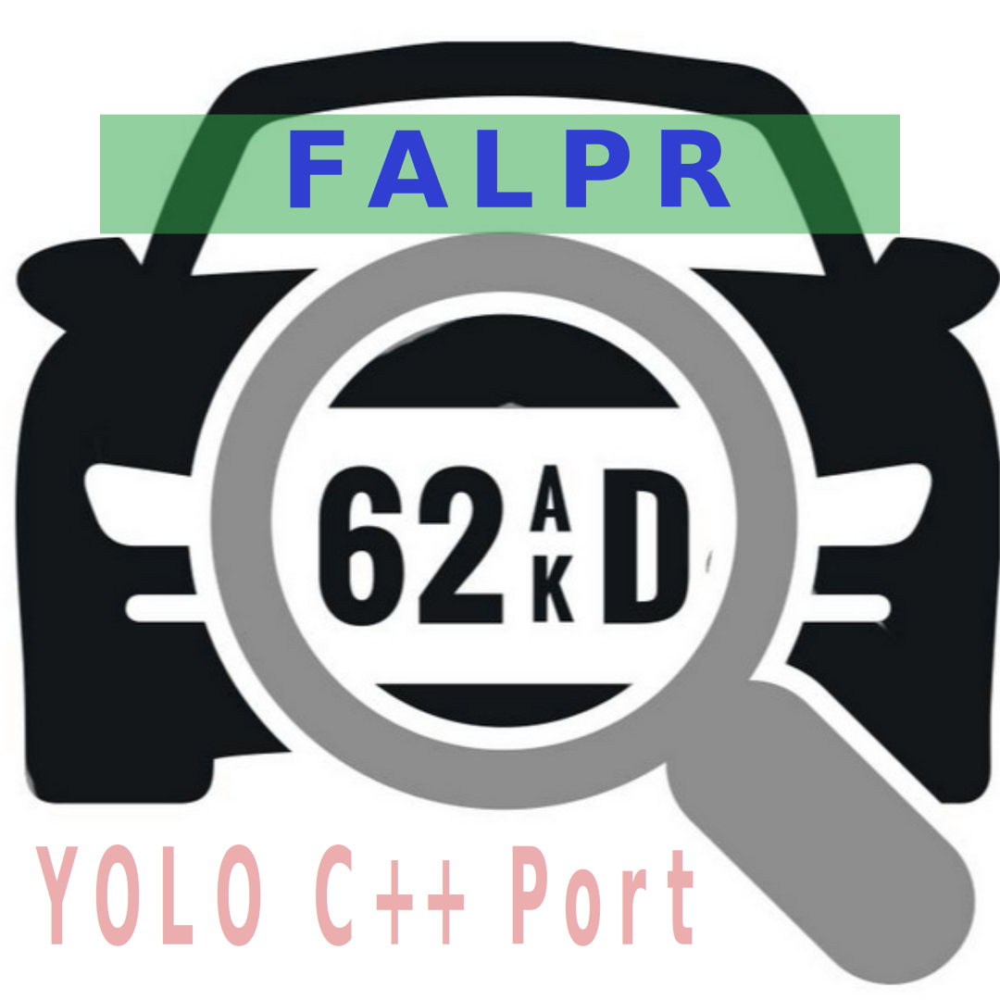

# FALPR

<p align="center">
  <a href="https://gitlab.com/watchdog-host/libs/falpr">
    
  </a>
</p>

<p align="center">
  <strong>FALPR: License Plate Detection and Recognition</strong>
</p>

<p align="center">
  <a href="https://github.com/RichardLitt/standard-readme">
    
  </a>
  <a href="https://conventionalcommits.org">
    
  </a>
  <a href="http://commitizen.github.io/cz-cli/">
    
  </a>
</p>

---

## 📌 Table of Contents

- [Installation](#installation)
- [Usage](#usage)
- [Data Preparation](#data-preparation)
- [Contributing](#contributing)
- [Community](#community)
- [License](#license)

## 🚀 Installation

```bash
git clone https://gitlab.com/watchdog-host/libs/falpr
cd falpr
mkdir build && cd build
cmake ..
make install
```

## 📖 Usage

Coming soon...

## 📂 Data Preparation

Information about preparing datasets will be added soon.

## 🤝 Contributing

We welcome contributions! Feel free to open an [issue](https://github.com/zjykzj/LPDet/issues) or submit a PR.

### Contribution Guidelines:
- Follow the [Conventional Commits](https://www.conventionalcommits.org/en/v1.0.0-beta.4/) standard.
- Adhere to [Semantic Versioning 2.0.0](https://semver.org) if versioning is needed.
- Keep README updates in line with [standard-readme](https://github.com/RichardLitt/standard-readme).

## 🌍 Community

Join our Telegram channel for discussions, updates, and support:
[](https://t.me/FALPR_Community)

## 📜 License
It's Open Source but before using please see ultralytics licence

© 2024 AlgoVision Solution. All rights reserved.